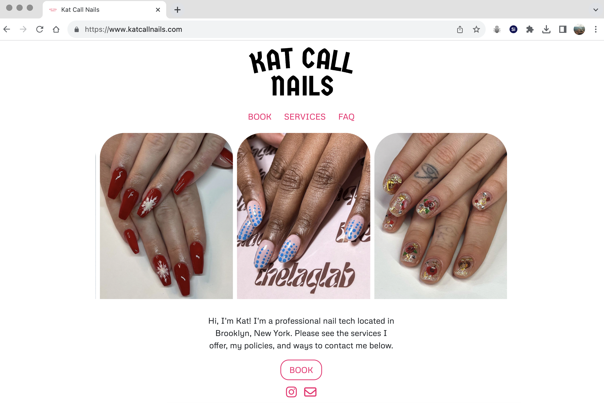
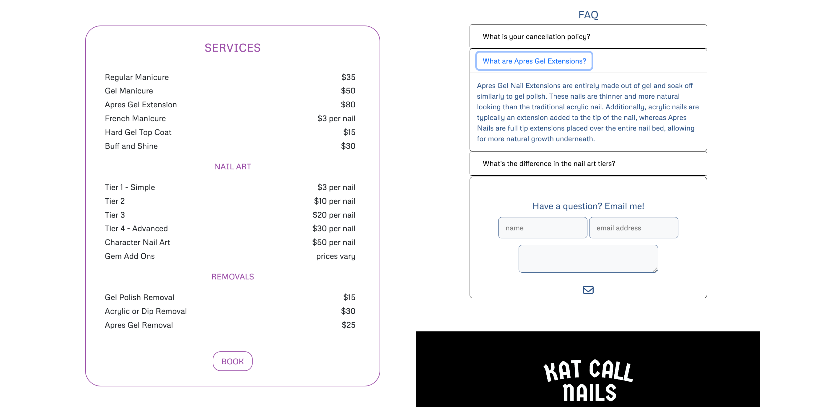

 

# Kat Call Nails

Kat Call Nails is a single page website for a local nail tech located in Brooklyn, NY. Initially, the client reached out to create a site through the Square app’s website builder in order to utilize the app’s appointment management features. To provide a more unique design than Square was capable of offering, I developed the site and logo from scratch. 

Here you will find the source code for the project and a link to the deployed site via Dreamhost: https://www.katcallnails.com/

#### Project Goals: 

 * organize the client’s Square account for proper appointment management (availability, services offered, price points)
 * design the UX/UI including the site logo with Figma and Canva
 * build a responsive site with advanced CSS, Bootstrap, and Javascript
 * launch the site via Dreamhost’s servers 

#### Conclusion:

While only a single page, I really enjoyed bringing this project to life. My favorite part was integrating the Splide.js feature into the title section to advertise the client’s work examples. It ended up being a unique way to pack a lot of punch at first load-up.

 **Languages**: JavaScript | CSS | HTML
  
 **Frameworks**: Bootstrap
  
 **UX/UI**: Figma | Canva 
  

 

